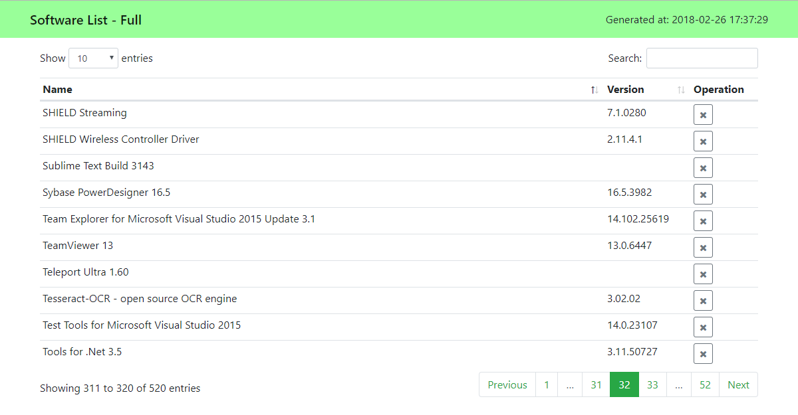

# SoftwareList

## Introduction

This is a software listing and updating assistant for Windows (and also listing for Android), which can create several kinds of **software lists** based on HTML.

## Functionalities

### Full List

Usage: Run `SLGetFullSoftwareList.py`

This will list all the Win32 applications (both system-wide and user-wide) installed in the current Windows system (by reading the registry). You can use the list to track changes of software on your computer.

### Main List

Usage: Run `SLGenerateMainSoftwareList.py`

This will generate a list from `MainSoftwareList.json`, which is configured manually by the user. From the full list, you can select important software items and put them into the main list (and you can assign priority values to them). The main list will be of great help when you get a new computer and want to install software that you had on the old machine.

### Update List

Usage: Run `SLCheckUpdate.py`

This will check updates for software items in the user-configured file `CheckUpdateList.json` and generate a list of software items that needs update. Method of retrieving update information of software (i.e. URL of their official websites and parsing rules) should be configured in `SLSoftwareInfo.py`.

### Android List

Usage: Run `SLGetAndroidSoftwareList.py`

This list is for Android. It lists all third-party packages installed on your Android device (using `adb`). `aapt` is required on your device (does not require root). You should connect your Android device to your PC, and configure `adb` and `aapt` executable paths in `Config.json`. You can refer to [this page](https://android.stackexchange.com/questions/90141/obtain-package-name-and-common-name-of-apps-via-adb) for reference.

### Themes

The HTML-based lists support several themes which you can configure in `Config.json`:

- Green
- Blue
- Pink
- Purple
- Random (Randomly choose one of the above)

### Other Utilities

- Run `SLCreateDailyUpdateTask.py` to create a daily task for software updating.
- Run `SLDeleteDailyUpdateTask.py` to delete the update task.
- Run `SLClearOldLists.py` to clear old software list of every kind, leaving only the newest ones respectively.
- Run `SLGetRegistryItems.py` to find software registry items by keywords.

## Screenshots

## Environment and Dependencies

### Environment

- OS: Windows 7 and higher versions
- Python 3.6+. You should install required modules via `pip install -r requirements.txt`

For using the Android list feature:

- OS: Android 7.0+
- `adb` on your PC
- `aapt` on your device (see reference [above](#android-list))

### Front-end Dependencies (Using CDN)

- Bootstrap
- Font Awesome
- jQuery
- DataTables

## Further Notes

- [Chocolatey](https://chocolatey.org/) is a package manager for Windows, which can facilitate automation of software updates. But not all applications are published on Chocolatey, and they are not always timely updated.
- UWP applications are automatically updated by Microsoft Store, but many of the applications we use are still legacy Win32 applications. In the future, more applications may become UWPs, but those who need a flexible command of system resources, including some tools for developers, may remain Win32-based.
